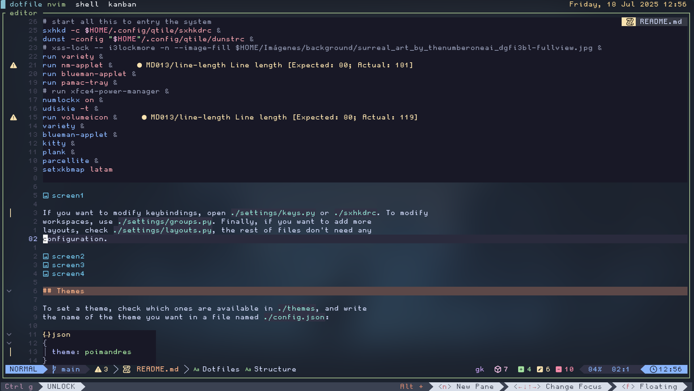
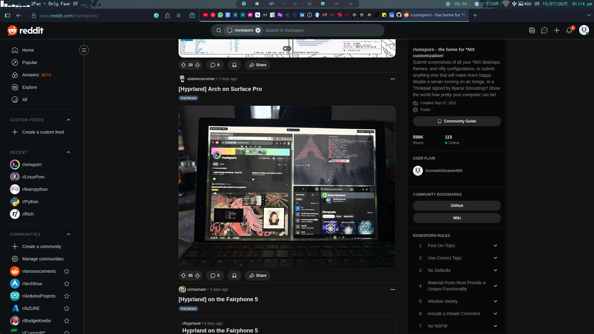

# Dotfiles


**_Idioma_**

- 🇪🇸 Español
- [🇺🇸 English](./README.md)

## Instalación (Arch or fedora)

Instala Qtile y las dependencias:

Clona este repositorio y copia mis configuraciones:

```bash
git clone https://github.com/KrashMello/dotfile.git
```

```bash
cd dotfile
```

```bash
./INSTALL.sh
```

## Estructura

En el archivo `config.py` que es donde la mayoría suele poner toda su
configuración, yo solo tengo el _autostart_ y algunas variables como
_cursor_warp_.

```python
@hook.subscribe.startup_once
def autostart():
    subprocess.call([path.join(qtile_path, 'autostart.sh')])
```

Para cambiar lo que se lanza en el _autostart_ abre el archivo
`./autostart.sh`.

```bash
#!/bin/sh
#
function run {
  if ! pgrep -x $(basename $1 | head -c 15) 1>/dev/null;
  then
    $@&
  fi
}
PATH="$HOME/.config/qtile/scripts:$PATH"
# dimension wide
xrandr --output HDMI-1 --mode 1920x1080 --pos 1920x85 --rotate normal --output HDMI-2 --off --output DP-1 --primary --mode 1920x1080 --pos 0x0 --rotate normal --output HDMI-3 --off
picom &
feh --bg-fill $HOME/Imágenes/background/km_background.png
# start all this to entry the system
sxhkd -c $HOME/.config/qtile/sxhkdrc &
dunst -config "$HOME"/.config/qtile/dunstrc &
# xss-lock -- i3lockmore -n --image-fill $HOME/Imágenes/background/surreal_art_by_thenumberoneai_dgfi3bl-fullview.jpg &
run variety &
run nm-applet &
run blueman-applet &
numlockx on &
udiskie -t &
blueman-applet &
kitty &
clipcatd &

```


Si quieres añadir o quitar atajos de teclado, abre `./settings/keys.py` o `./sxhkdrc`.
Para añadir o quitar espacios de trabajos, debes modificar
`./settings/groups.py`. Finalmente, si quieres añadir nuevos _layouts_,
abre `./settings/layouts.py`, el resto de archivos no hace falta tocarlos.







## Temas

Para establecer un tema, mira los que hay disponibles en `./themes`, y
coloca su nombre en un archivo llamado `./config.json`:

```json
{
  "theme": "km"
}
```

## Atajos de teclado

| key | action |
| ------------- | -------------- |
| <win + space> | rofi menu |
| <win + shift +space> | rofi show windows |
| <control + alt + h> | clipcat menu |
| <win + b> | open firefox |
| <win + c> | open vscode |
| <win + backspace> | powermenu  |
| <win + shift + f> | floating window  |
| <win + f> | fullscreen window  |
| <win + w> | kill window  |
| <win + period> | restart qtile  |
| <win + enter> | kitty  |
| <win + shift + enter> | floating kitty  |
| <win + e> | file manager (yazi)  |
| <win + shift + l> | keyboard layout  |
| <win + s> | screenshots  |
| <win + shift + s> | select screenshots  |
| <win + alt + s> | 10 sec screenshots  |
