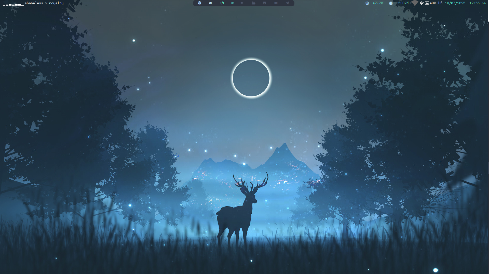

# Dotfiles

 

***Idioma***
- 🇪🇸 Español
- [🇺🇸 English](./README.md)

## Instalación (Arch)

Instala Qtile y las dependencias:

```bash
sudo pacman -S qtile pacman-contrib
yay -S nerd-fonts-ubuntu-mono
pip install psutil
```

Clona este repositorio y copia mis configuraciones:

```bash
git clone
cp -rf dotfiles/.config/* ~/.config
```


## Estructura

En el archivo ```config.py``` que es donde la mayoría suele poner toda su
configuración, yo solo tengo el *autostart* y algunas variables como
*cursor_warp*.

```python
@hook.subscribe.startup_once
def autostart():
    subprocess.call([path.join(qtile_path, 'autostart.sh')])
```

Para cambiar lo que se lanza en el *autostart* abre el archivo 
```./autostart.sh```.

```bash
#!/bin/sh

# keymap
setxkbmap latam
# systray volume
volumeicon &

# picom
picom &
# imagen
feh --bg-fill ~/.config/qtile/assets/fondo.png

# start all this to entry the system

alacritty &
alacritty & 
#alacritty -e htop &
alacritty &
notes &
subl &
google-chrome-stable &
```


Si quieres añadir o quitar atajos de teclado, abre ```./settings/keys.py```.
Para añadir o quitar espacios de trabajos, debes modificar
```./settings/groups.py```. Finalmente, si quieres añadir nuevos *layouts*,
abre ```./settings/layouts.py```, el resto de archivos no hace falta tocarlos.


## Temas

Para establecer un tema, mira los que hay disponibles en ```./themes```, y
coloca su nombre en un archivo llamado ```./config.json```:

```json
{
    "theme": "km"
}
```
