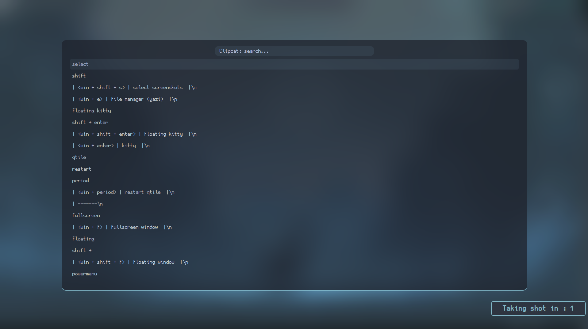

# Dotfiles


- [🇪🇸 Español](./README.es.md)
- 🇺🇸 English

## Installation (Arch based or fedora)

Install Qtile and dependencies:

Clone this repository and copy my configs:

```bash
git clone https://github.com/KrashMello/dotfile.git
```

```bash
cd dotfile
```

```bash
./INSTALL.sh
```

## Structure

In `config.py`, which is the file where most people write all their config,
I only have an *autostart* function and some other variables like
*cursor_warp*.

```python
@hook.subscribe.startup_once
def autostart():
    subprocess.call([path.join(qtile_path, 'autostart.sh')])
```

If you want to change *autostart* programs, open `./autostart.sh`.

```bash
#!/bin/sh
#
function run {
  if ! pgrep -x $(basename $1 | head -c 15) 1>/dev/null;
  then
    $@&
  fi
}
PATH="$HOME/.config/qtile/scripts:$PATH"
# dimension wide
xrandr --output HDMI-1 --primary --mode 1920x1080 --pos 1280x0 --rotate normal --output HDMI-2 --off --output DP-1 --mode 1280x1024 --pos 0x588 --rotate normal --output HDMI-3 --off
picom &
feh --bg-fill $HOME/Imágenes/background/wallhaven-1pwl61_1920x1080.png
# start all this to entry the system
sxhkd -c $HOME/.config/qtile/sxhkdrc &
dunst -config "$HOME"/.config/qtile/dunstrc &
# xss-lock -- i3lockmore -n --image-fill $HOME/Imágenes/background/surreal_art_by_thenumberoneai_dgfi3bl-fullview.jpg &
run variety &
run nm-applet &
run blueman-applet &
run pamac-tray &
# run xfce4-power-manager &
numlockx on &
udiskie -t &
run volumeicon &
variety &
blueman-applet &
kitty &
plank &
parcellite &
setxkbmap latam

```


If you want to modify keybindings, open `./settings/keys.py` or `./sxhkdrc`. To modify
workspaces, use `./settings/groups.py`. Finally, if you want to add more
layouts, check `./settings/layouts.py`, the rest of files don't need any
configuration.





## Themes

To set a theme, check which ones are available in `./themes`, and write
the name of the theme you want in a file named `./config.json`:

```json
{
  "theme": "poimandres"
}
```

## Keybindings

| key | action |
| ------------- | -------------- |
| <win + space> | rofi menu |
| <win + shift +space> | rofi show windows |
| <control + alt + h> | clipcat menu |
| <win + b> | open firefox |
| <win + c> | open vscode |
| <win + backspace> | powermenu  |
| <win + shift + f> | floating window  |
| <win + f> | fullscreen window  |
| <win + w> | kill window  |
| <win + period> | restart qtile  |
| <win + enter> | kitty  |
| <win + shift + enter> | floating kitty  |
| <win + e> | file manager (yazi)  |
| <win + shift + l> | keyboard layout  |
| <win + s> | screenshots  |
| <win + shift + s> | select screenshots  |
| <win + alt + s> | 10 sec screenshots  |
