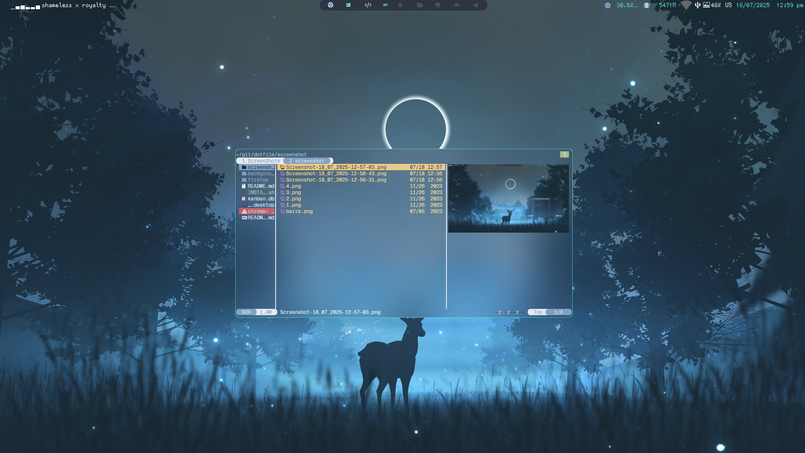

# Dotfiles


*barra*Language***
- [🇪🇸 Español](./README.es.md)
- 🇺🇸 English

## Installation (Arch based)

Install Qtile and dependencies:

```
sudo pacman -S qtile pacman-contrib
yay -S nerd-fonts-ubuntu-mono
pip install psutil
```

Clone this repository and copy my configs:

```bash
git clone
cp -rf dotfiles/.config/ ~/.config
```

## Structure

In ```config.py```, which is the file where most people write all their config,
I only have an *autostart* function and some other variables like
*cursor_warp*.

```python
@hook.subscribe.startup_once
def autostart():
    subprocess.call([path.join(qtile_path, 'autostart.sh')])
```

If you want to change *autostart* programs, open  ```./autostart.sh```.

```bash
#!/bin/sh

# keymap
setxkbmap latam
# systray volume
volumeicon &

# picom
picom &
# imagen
feh --bg-fill ~/.config/qtile/assets/fondo.png

# start all this to entry the system

alacritty &
alacritty & 
#alacritty -e htop &
alacritty &
notes &
subl &
google-chrome-stable &
```


If you want to modify keybindings, open ```./settings/keys.py```. To modify
workspaces, use ```./settings/groups.py```. Finally, if you want to add more
layouts, check ```./settings/layouts.py```, the rest of files don't need any
configuration.



## Themes

To set a theme, check which ones are available in ```./themes```, and write
the name of the theme you want in a file named ```./config.json```:

```json
{
    "theme": "km"
}
