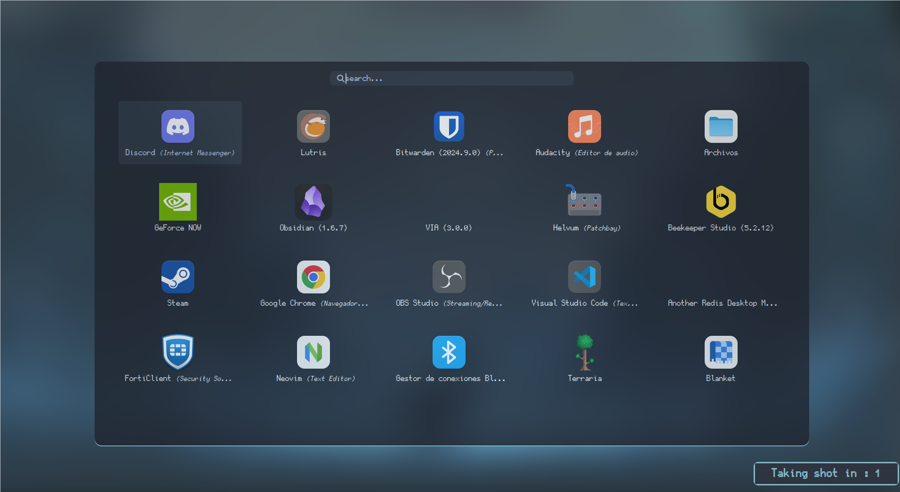

# Dotfiles


*barra*Language\*\*\*

- [🇪🇸 Español](./README.es.md)
- 🇺🇸 English

## Installation (Arch based)

Install Qtile and dependencies:

```
sudo pacman -S qtile pacman-contrib
yay -S nerd-fonts-ubuntu-mono
pip install psutil
```

Clone this repository and copy my configs:

```bash
git clone
cp -rf dotfiles/.config/ ~/.config
```


## Structure

In `config.py`, which is the file where most people write all their config,
I only have an _autostart_ function and some other variables like
_cursor_warp_.

```python
@hook.subscribe.startup_once
def autostart():
    subprocess.call([path.join(qtile_path, 'autostart.sh')])
```

If you want to change _autostart_ programs, open `./autostart.sh`.

```bash
#!/bin/sh
#
function run {
  if ! pgrep -x $(basename $1 | head -c 15) 1>/dev/null;
  then
    $@&
  fi
}
PATH="$HOME/.config/qtile/scripts:$PATH"
# dimension wide
xrandr --output DP-1 --off --output HDMI-1 --mode 1920x1080 --pos 0x0 --rotate normal --output DVI-I-1 --mode 1280x1024 --pos 320x1080 --rotate normal
run polybar kmbar --config=$HOME/.config/qtile/polybar/config.ini
picom &
#feh --bg-fill ~/Imágenes/sakura.png
# start all this to entry the system
sxhkd -c $HOME/.config/qtile/sxhkdrc &
dunst -config "$HOME"/.config/qtile/dunstrc &
run variety &
run nm-applet &
run pamac-tray &
run xfce4-power-manager &
numlockx on &
run blueberry-tray &
udiskie -t &
run volumeicon &
/usr/lib/xfce4/notifyd/xfce4-notifyd &
kitty &

# notes &


```


If you want to modify keybindings, open `./settings/keys.py`. To modify
workspaces, use `./settings/groups.py`. Finally, if you want to add more
layouts, check `./settings/layouts.py`, the rest of files don't need any
configuration.




## Themes

To set a theme, check which ones are available in `./themes`, and write
the name of the theme you want in a file named `./config.json`:

```json
{
  "theme": "km"
}
```
